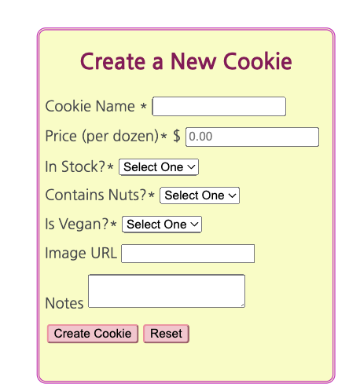
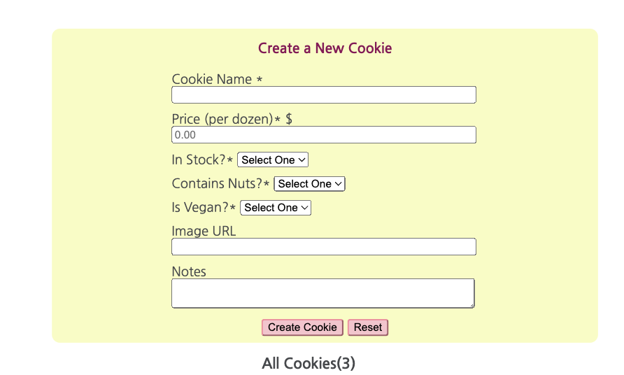

# Cookie Shop Web Inventory Application  

Welcome to the Cookie Shop Application, a simple tool for managing your cookie inventory. This application provides features for users to create, view, and delete items in your inventory.

## Features 

### Create A Cookie
- A user can create an inventory item using the 'Create a New Cookie' form located on the left side of the page

> Located at the top of the page for browsers less than 880px. 

### *Index*
- A user can see a list of all items added to the cart, displaying the following information:
  - ID
  - Name
  - Price in dollars

### *Show*
- A user can see the details of a specific item by its unique ID.
- Cookie ids __are__ case sensitive.

### *Show Vegan*
- Users can view a list of all vegan cookies available in the menu along with their prices.

### *Show Nut-Free*
- A list of all nut-free cookies from the menu is displayed, complete with their prices.

### *Destroy*

## Contributing 

We welcome contributions to the Cookie Shop Inventory Web Application. If you have ideas for improvements or want to report issues, please open a GitHub issue and submit a pull request.

Happy cookie shopping!

