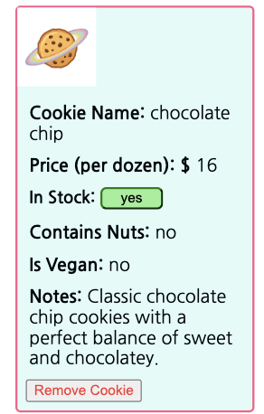

# Cookie Shop Inventory Web Application  

Welcome to the Cookie Shop Application, a simple tool for managing your cookie inventory. This application provides features for users to create, view, and delete items in your inventory.

## Features 

### Create A Cookie
A user can create an inventory item using the 'Create a New Cookie' form located on the left side of the page.

> Note: This is located at the top of the screen for browsers less than 880px. 

#### How to create a cookie: 
- ``Cookie Name``: (required) The name of the cookie you want to add.
- ``Price``(per dozen): (required) The price per dozen of the item in dollars.
- ``In Stock?``: (required) Choose 'Yes' or 'No' for whether the item is in stock (this can be changed later on).
- ``Contains Nuts?``: (required) Choose 'Yes' or 'No' for whether the item contains nuts.
- ``Is Vegan?``: (required) Choose 'Yes' or 'No' for whether the item contains nuts.
- ``Image URL``: (optional) If you have an image you want to use for the item, paste the image adress here!
- ``Notes``: (optional) Here is where you can add any extra details or descriptions of your item.
- Click ``Submit`` to create your new cookie inventory item.
>Note: Clicking the ``"Reset"`` button will clear the entire form.

You new cookie inventory item will look something like this:

#### How to delete a cookie:
- Click the ``red "Remove Cookie"`` button under any inventory item to remove that item from the inventory. 

#### Interactive Features:
- The user can dynamically update the "in stock" value for existing inventory items. 
Click on the ``red "yes"`` or ``green "no"`` buttton to change "in stock" to "out of stock", and vice versa.

- The cookie count at the top of the inventory list will show an updated count of all the cookies in the inventory.

## Contributing 

We welcome contributions to the Cookie Shop Inventory Web Application. If you have ideas for improvements or want to report issues, please open a GitHub issue and submit a pull request.

Happy cookie shopping!

